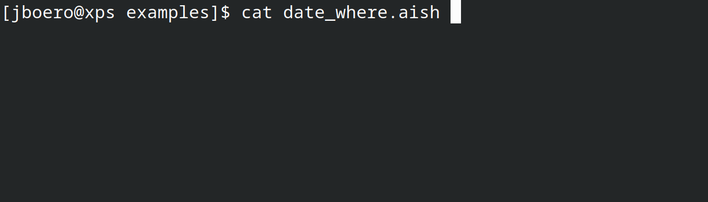

# AISH - The AI Shell
This general CLI for LLM chats is designed to support as many AI interfaces as possible. It supports simple chat modes as well as a shell modes. This shell takes your commands and does what you ask via translating them to intermediate scripting languages and running them. Beware the risk of AI running or deleting something you didn't expect. Use at your own risk. Whatever mode you use you may choose to override the AI temperature via the environment variable: 
`AISH_TEMP` defaults to 0.2. Sessions are not currently persisted to disk and each run is a new thread.

[](https://youtu.be/8t8u9x9FtdQ)
# Installing
Latest releases are available for RPM based Linux distros at the BrynzAI COPR: https://copr.fedorainfracloud.org/coprs/boeroboy/brynzai/ 
```
dnf copr enable boeroboy/brynzai
dnf install aish
```
Prerequisites include `libjsoncpp` and `libcurl`.
## Build from Source
Install `jsoncpp-devel` and `libcurl-devel` and simply run `make`. Audio mode will require the `festival` library and deps.
It is statically linked. Enable this with AUDIO_MODE=1.

# Using
Optionally set temperature via `AISH_TEMP` environment variable. The rest depends on the mode being used, which defaults to `shellbard`.
## Modes
Modes are specified with the `-m` arg. Modes fall into two categories: shell or default (chat). Shell mode tries to translate your input into local commands and runs them immediately. Chat mode is simple chat as you may encounter in the browser. Currently there are for modes supported which are documented below:
1. shellbard
2. shellgpt
3. shellllama
4. bard
4. chatgpt
5. llama

Default mode is currently `shellbard`.
## OpenAI GPT Mode
Environment variables are required to use GPT. Currently support is just 3.5-turbo but support for setting the model will be added soon. These should be set to your values:
1. `OPENAI_ORG` your organization ID.
2. `OPENAI_API_KEY` your API key.
There are two options for GPT: `chatgpt` and `shellgpt`.
### chatgpt
This mode is standard chatgpt as used in the browser.
### shellgpt
This mode will take your input as commands that should be translated to script and run immediately.

## Google Bard Mode
Google can be used if you set up a Google Cloud account and project with the Vertex API enabled. Then you will be able to connect using the environment variables:
1. `CLOUDSDK_CORE_PROJECT` set to your project.
2. `GOOGLE_APPLICATION_CREDENTIALS` set to your valid OIDC token.
Note that OIDC tokens may expire frequently and need to be refreshed. There is currently no automation support for this in aish.
### bard
Simple chat as with the Bard page. Your identity will also allow management of cloud resources in your GCP project.
### shellbard
Shellbard is the default mode and will translate your input to local shell code and execute it immediately.
### gemini
Gemini is currently a stub but will add support for it as soon as I can get my hands on the API.

## Llama2 Server
I packaged Llama.cpp for Fedora/RPM distributions and added support for Llama server. This local REST API is simple and unauthenticated.
Simply specify your Llama server with the env var `LLAMA_SERVER`. Streaming is enabled which required a new curl handler.
1. `LLAMA_SERVER=http://localhost:8080/completion` localhost is the default.

# Group Chat
As of 0.2.0 it is possible to cross-chat between plugins. If the first word in your command is one of the plugin names, 
the mode will be switched to that plugin and all current thread history will be carried over. This is a great way to ask 
for a second opinion (note the population given is incorrect - no way Wisconsin has a billion people):
```
jboero@xps ~/c/aish (0.2.0)> ./aish -m llama
llama🙂> Hi Llama. Can you tell me what year Wisconsin became a state?
1848. Wisconsin was admitted as the 30th U.S. state on May 29, 1848.
llama🙂> Bard, do you agree with Llama?
bard🫡:
Llama is correct. Wisconsin became the 30th state of the United States on May 29, 1848.
bard🙂> Llama what's its population?
llama🫡:
1023768954
llama🙂>
```

# Scripts
The shell modes support scripts. So you can write a script in human language:
```
#!/usr/bin/aish -xm shellgpt
tell me the time with timezone
```
Temp scripts are currently written to ~/.aish/ which is hard-coded to my own user unfortunately. Just trying to get initial commits.
Check the examples directory for more.
```
#!/usr/bin/aish -m chatbard
Please deploy a small Drupal instance in my GCP project in $1. Use Cloud Run if possible. Please do it for me.
```
Running these scripts with parameters becomes simple:
```
./drupal.aish London
Sure, I can do that. Here are the steps I will take:

1. Create a new Cloud Run service in the London region.
2. Deploy the Drupal code to the service.
3. Configure the service to serve traffic on port 80.
4. Create a new DNS record for the service.

Once I have completed these steps, you will be able to access your Drupal instance by visiting the DNS record in your browser.
```


# Writing Plugins
Plugin architecture has been super simplified. No OOP or classes are necessary. Simply write your function that handles a std::string cmd parameter and returns an int for success. Then register that function pointer to the plugin system by instantiating a global plugin instance with the string name of your handler.  As the design pattern goes, it's an ugly code, but the it checks out.

Make sure to use (and not change) the global ostream pointer `*logs` instead of cout directly. Doing so will let the global output mode change including audio text to speech mode or whatever file redirection happens in the future.

# Changelog
## 0.2.0 (21-SEP-2023)
1. Added support for Llama2 via Llama.cpp server.
2. Simplified plugin architecture.
3. Festival voice output option via `-a`
4. Cross-plugin context enables group chat between generative AIs.
